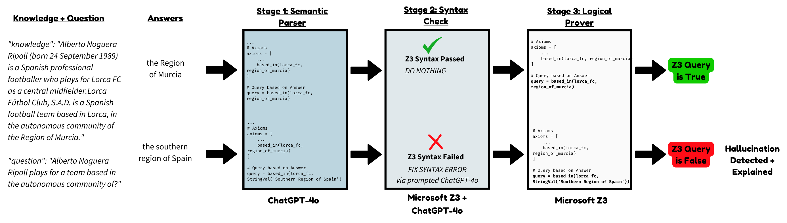
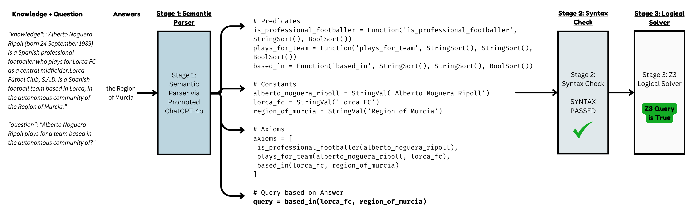
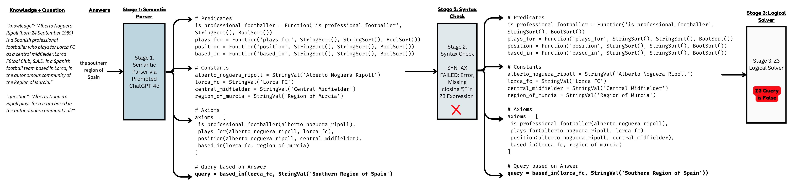

<p align="center">
  
  <br>
  <i><b>H</b>a<b>L</b>lucination <b>I</b>nference via <b>N</b>eurosymbolic <b>C</b>omputation</i>
</p>


## Overview

HLINC is a modular neurosymbolic approach for <b>detecting AND explaining</b> hallucinations in knowledge-grounded LLM conversations. Using [HaluEval's Q/A dataset](https://github.com/RUCAIBox/HaluEval/tree/main) (a dataset generated from ChatGPT outputing hallucinated responses from conversations), we test HLINC's ability to detect and explain these hallucinations.
	
- **Stage 1** uses ChatGPT as a Semantic Parser, converting Knowledge-Grounded Questions and Answers into Microsoft's Z3 Logical Solver Syntax. 
- **Stage 2** runs all of the converted code with a Z3 Logical Solver, passing each syntax/error that occurs from the logical solver back through the Semantic Parser (ChatGPT) with the added Syntax Error context.
- **Stage 3** runs the Z3 code through the Logic Solver to detect and explain the hallucinations.  

<p align="center">
  
</p>


## Results

<body>


<table>
  <tr>
    <th>Dataset</th>
    <th>Approach</th>
    <th>Correctly Detected Hallucinations</th>
    <th>Explainability</th>
  </tr>
  <tr>
    <td>HaluEval Dialogue w/ Knowledge</td>
    <td>HLINC</td>
    <td>--</td>
    <td>YES</td>
  </tr>
  <tr>
    <td>HaluEval Dialogue w/ Knowledge</td>
    <td>ChatGPT</td>
    <td>--</td>
    <td>NO</td>
  </tr>
  <tr>
    <td>HaluEval Q/A w/ Knowledge</td>
    <td>HLINC</td>
    <td>7149/10000 (71.49%)</td>
    <td>YES</td>
  </tr>
  <tr>
    <td>HaluEval Q/A w/ Knowledge</td>
    <td>ChatGPT</td>
    <td>--</td>
    <td>NO</td>
  </tr>
  
</table>

</body>

<br>
<b>HaluEval Dialogue w/ Knowledge</b> <br>

Stage 1: stage-1-dialogue.txt
  
Stage 2: stage-2-dialogue.txt
- Syntax Errors Detected: 423/10000 (4.23%)
- Syntax Errors Fixed: /423

Stage 3:
- Correctly Detected Hallucinations: 7149/10000 (71.49 %)

<br>
<b>HaluEval Q/A w/ Knowledge</b> <br>

Stage 1: [data/stage-1.txt](https://github.com/HaydenMM/HLINC/blob/dev/data/stage-1.txt)
  
Stage 2: [data/stage-2.txt](https://github.com/HaydenMM/HLINC/blob/dev/data/stage-2.txt)
- Syntax Errors Detected: 795/10000 (7.95%)
- Syntax Errors Fixed: 489/795

Stage 3:
- Correctly Detected Hallucinations: 7149/10000 (71.49 %)

## Files
Z3 Sematic Parser: [notebooks/z3_semantic_parser.ipynb](https://github.com/HaydenMM/HLINC/blob/dev/notebooks/z3_semantic_parser.ipynb)

Z3 Logical Solver: [notebooks/z3_logical_solver.ipynb](https://github.com/HaydenMM/HLINC/blob/dev/notebooks/z3_logical_solver.ipynb)


<br>


## Appendix
#### Example of a Correct Answer with no syntax errors
<p align="center">
  
</p>

#### Example of a Hallucinated Answer with a syntax error
<p align="center">
  
</p>

## Acknowledgements
<b>Thanks to "LINC: A Neurosymbolic Approach for Logical Reasoning by Combining Language Models with First-Order Logic Provers" for the inspiration to this work!</b>
<br>
- Paper: https://arxiv.org/abs/2310.15164
- GitHub: https://github.com/benlipkin/linc
```
@inproceedings{OGLZ_LINC_2023,
	author={Theo X. Olausson* and Alex Gu* and Ben Lipkin* and Cedegao E. Zhang* and Armando Solar-Lezama and Joshua B. Tenenbaum and Roger P. Levy},
	title={LINC: A neuro-symbolic approach for logical reasoning by combining language models with first-order logic provers},
	year={2023},
	journal={Proceedings of the Conference on Empirical Methods in Natural Language Processing},
}
```
<b>Thanks to "HaluEval: A Large-Scale Hallucination Evaluation Benchmark for Large Language Models" for the datasets used in this work!</b>
<br>
- Paper: https://arxiv.org/abs/2305.11747
- GitHub: https://github.com/RUCAIBox/HaluEval
```
@misc{HaluEval,
  author = {Junyi Li and Xiaoxue Cheng and Wayne Xin Zhao and Jian-Yun Nie and Ji-Rong Wen },
  title = {HaluEval: A Large-Scale Hallucination Evaluation Benchmark for Large Language Models},
  year = {2023},
  journal={arXiv preprint arXiv:2305.11747},
  url={https://arxiv.org/abs/2305.11747}
}
```


## Reference
```
@misc{HLINC,
  author = {Hayden Moore},
  title = {HLINC: A Neurosymbolic Approach for Detecting and Explaining LLM Hallucinations in Knowledge-Grounded Contexts},
  year = {2025},
  journal={},
  url={}
}```
