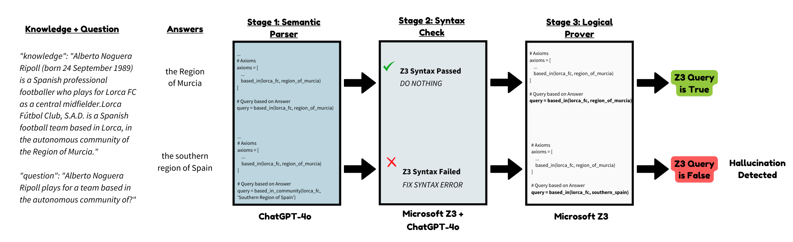
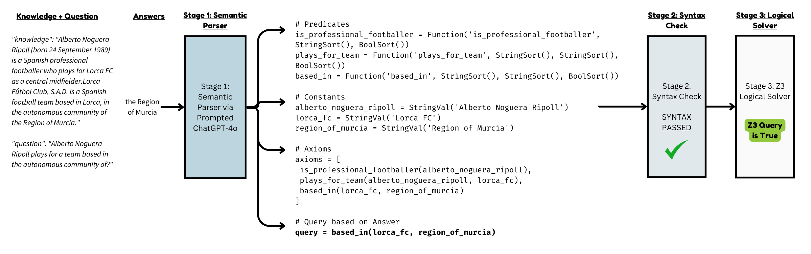
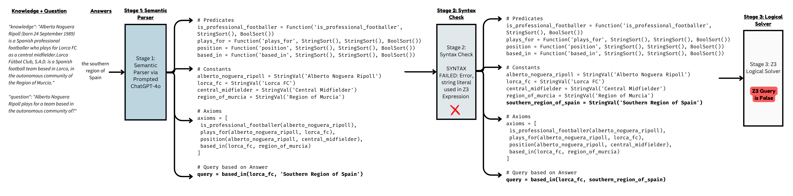

<p align="center">
  
  <br>
  <i><b>H</b>a<b>L</b>lucination <b>I</b>nference via <b>N</b>eurosymbolic <b>C</b>omputation</i>
</p>

## Overview
<p align="center">
  
</p>

#### Example of a Correct Answer with no syntax errors
<p align="center">
  
</p>

#### Example of a Hallucinated Answer with a syntax error
<p align="center">
  
</p>

## Acknowledgements
<b>Thanks to "LINC: A Neurosymbolic Approach for Logical Reasoning by Combining Language Models with First-Order Logic Provers" for the inspiration to this work!</b>
<br>
- Paper: https://arxiv.org/abs/2310.15164
- GitHub: https://github.com/benlipkin/linc
```
@inproceedings{OGLZ_LINC_2023,
	author={Theo X. Olausson* and Alex Gu* and Ben Lipkin* and Cedegao E. Zhang* and Armando Solar-Lezama and Joshua B. Tenenbaum and Roger P. Levy},
	title={LINC: A neuro-symbolic approach for logical reasoning by combining language models with first-order logic provers},
	year={2023},
	journal={Proceedings of the Conference on Empirical Methods in Natural Language Processing},
}
```
<b>Thanks to "HaluEval: A Large-Scale Hallucination Evaluation Benchmark for Large Language Models" for the datasets used in this work!</b>
<br>
- Paper: https://arxiv.org/abs/2305.11747
- GitHub: https://github.com/RUCAIBox/HaluEval
```
@misc{HaluEval,
  author = {Junyi Li and Xiaoxue Cheng and Wayne Xin Zhao and Jian-Yun Nie and Ji-Rong Wen },
  title = {HaluEval: A Large-Scale Hallucination Evaluation Benchmark for Large Language Models},
  year = {2023},
  journal={arXiv preprint arXiv:2305.11747},
  url={https://arxiv.org/abs/2305.11747}
}
```


## Reference
```
@misc{HLINC,
  author = {Hayden Moore},
  title = {HLINC: A Neurosymbolic Approach for Detecting LLM Hallucinations in Knowledge-Grounded Contexts},
  year = {2025},
  journal={},
  url={}
}```
